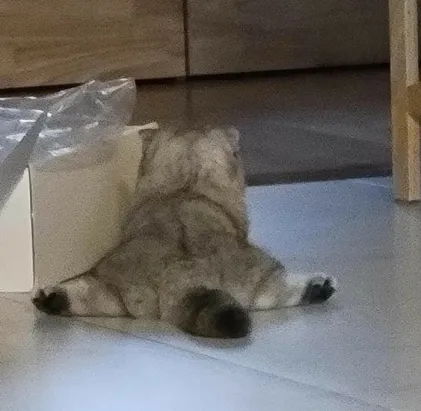

---
authors:
  - adalinda
tags:
  - события
  - угадай мелодию
---

# Угадай мелодию с Адалиндой

Всем привет, я — Адалинда и мне 16 лет! Вчера я поиграла с ребятами в «Угадай мелодию» в Носке и мне есть что сказать 😾

## Игра с Агентом

По-началу, все шло хорошо. Я играла с Агентом, а уж чего-чего, а его обмухлевывать, точнее, обыгрывать я научилась давно. Ну, а что? Он все равно спит в голосовых, так что с него не убудет.

*Я играю честно-честно, ведь я — честная кошечка!*

Он решил начать с песен Арии, но его это не спасло: я запросто его обыграла и угадала почти все песни. Это была великолепная победа.

## Необычный новичок Swarog

Потом пришел Swarog. По-началу, он не понял, куда в боте нажимать, и я решила показать ему на своей любимой рубрике «Русская попса нулевых», как нужно играть. Тут мне не было равных, и Агент плелся в хвостике со Сварогом. Они только и успевали, что у меня списывать ответы. Как же я хороша.

Впрочем, новичку стоит отдать должное: играл он немного лучше Агента. И тогда я спросила: какую музыку он слушает? Он ответил, что слушает современный, русский рок. Агент оживился, подхватил эту тему, и тут началась полоса неудач.

Я даже песен таких не слышала, а он ещё и подпевал! Мне пришлось делить второе место с Агентом. Хорошо, что он вообще ничего не знает и спит в голосовых, иначе бы вообще оказалась на последнем месте! Этот новичок совсем непрост 😾

## Любитель забугорных песен Trashwork

Пока я отходила от поражения, пришел Trashwork. Агент перепутал его с математиком (видимо, спросонья), но меня интересовало другое: что из русской попсы слушает он?! Trashwork ответил, что слушает вообще что-то забугорное, и я утратила к нему всяческий интерес.

Предложила рубрику «Короля и Шута», Агент подхватил, будто искренне верил в победу, остальные не возражали.

И тут всё шло неплохо, но Сварог вырвался вперёд. Уже и Агент проснулся и начал свое "Что за песня? Дай списать!". "Учиться надо было", — хотелось ответить ему, но я и сама понятия не имела, что там за песни играли.

В итоге Сварог победил и нажил себе сущего врага!

## Обсуждение "Во все тяжкие"

Пока я точила когти к предстоящей кровавой битве, Сварог обмолвился, что хочет досмотреть серию "Во все тяжкие". "Ну уж нет, так просто ты не уйдешь", — подумала я и хотела уже было его остановить, но Trashwork опередил меня и начал жаловаться на сюжет сериала. Завязался спор. Даже Агент проснулся и решил вставить свои пять копеек. Я всё равно сериал не смотрела, поэтому сосредоточилась на другом.

*Разминка перед боем*

## Математик Nightspore

Едва я закончила разминаться, как вдруг услышала:

— О, математик! — воскликнул Агент, когда зашёл Nightspore. Ой, та для него каждый второй — математик! Уже и Nightspore начал говорить, что пора менять ник, чтобы не узнавали, а Trashwork вообще начал подозревать, что "математик" — это какое-то обзывательство.

Впрочем, о чем это я? Ах да, про ёлку Агента (когда он уже ее наконец-то выбросит?), а ещё про орден флудера, а. теперь про теорию категорий, теорию групп и прочем занудстве, которое развел Агент с математиком. Стоп, когда играть начнем?!

Начала возвращать Агента с математических абстракций на землю, но он — смолк, т.е. пропал. Нет, он не заснул, как обычно это бывает, а отвалился с Discord'а. Получается, я не смогу теперь отыграться?!

## И снова "Король и шут"

кричала: «Даёшь попсу!»
математик потыкался и натыкал КиШ
начали, Сварог снова выиграл, Ада на втором месте

## Сама всё натыкаю

Начала тыкать "Русскую попсу 2000-ых", но все пошло мимо, и включилась зарубежная музычка 2000-ых. Там была и попсятинка, и рэпчинка — чего только не было

Трэшворк оживился, потому что вроде как слушает такое. "Давай, Трэшворк, отгадывай!", — кричала я, а сама у него списывала. Потом пару раз тыкнула не то, что он, и угадала. В итоге оказалась на первом месте. Справедливость восторжествовала 😌
